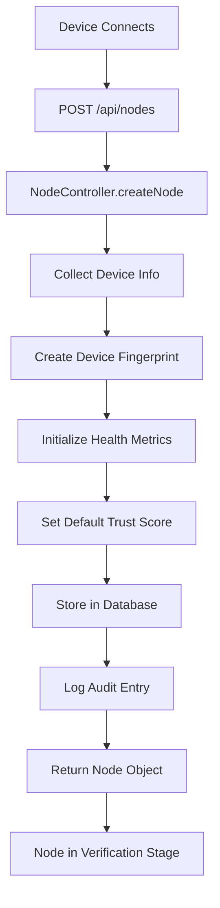
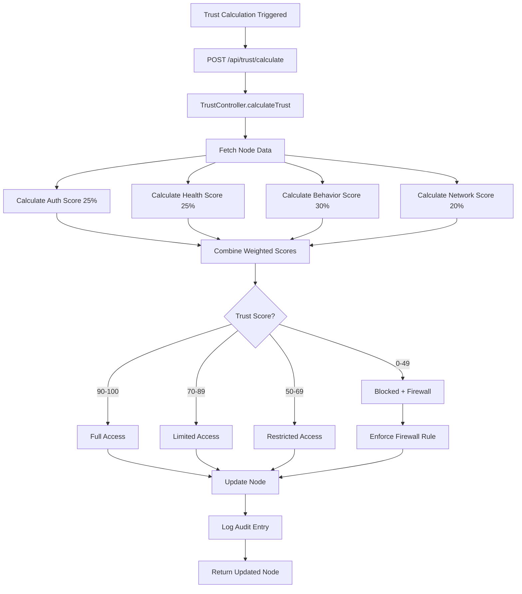
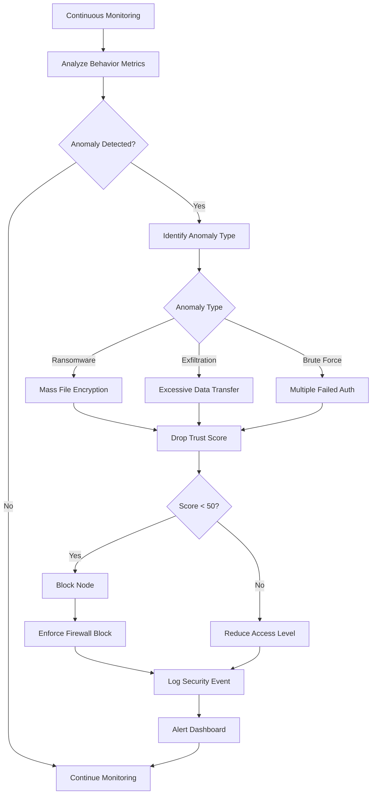
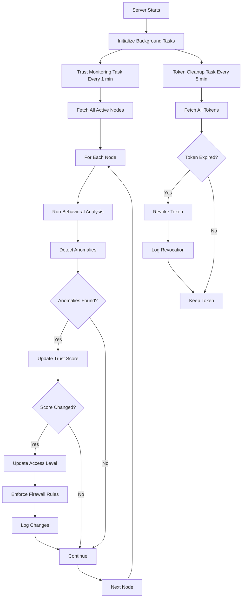

# Zero Trust Storage Area Network (SAN) - Project Report

## Executive Summary

This project implements a **production-ready Storage Area Network with Zero Trust Architecture** that continuously verifies devices, monitors behavior, and enforces dynamic access control based on real-time trust scores. The system follows the **"Never Trust, Always Verify"** principle to provide enterprise-grade security.

---

## 1. Project Overview

### 1.1 What is Zero Trust Architecture?

Zero Trust is a security framework that eliminates implicit trust and requires continuous verification of every user and device trying to access resources. Unlike traditional perimeter-based security, Zero Trust assumes:
- No user or device is trusted by default
- Every access request must be verified
- Access is granted based on real-time risk assessment

### 1.2 Project Objectives

✅ **Implement continuous device verification**  
✅ **Monitor device health and security posture**  
✅ **Calculate dynamic trust scores based on multiple factors**  
✅ **Detect anomalies and malicious behavior in real-time**  
✅ **Enforce firewall rules automatically**  
✅ **Maintain comprehensive audit logs for compliance**

---

## 2. System Architecture

### 2.1 High-Level Architecture

```
┌─────────────────────────────────────────┐
│         CLIENT DEVICE                   │
│  • Health metrics                       │
│  • Authentication credentials           │
│  • Behavioral data                      │
└─────────────────────────────────────────┘
                 ↓ HTTPS/TLS
┌─────────────────────────────────────────┐
│    ZERO TRUST SAN SERVER (Node.js)      │
│  ┌───────────────────────────────────┐  │
│  │  Authentication Service (JWT)     │  │
│  │  Health Check Service             │  │
│  │  Trust Scoring Engine             │  │
│  │  Behavioral Monitor               │  │
│  │  Anomaly Detector                 │  │
│  │  Access Control (Firewall)        │  │
│  └───────────────────────────────────┘  │
└─────────────────────────────────────────┘
                 ↓
┌─────────────────────────────────────────┐
│    MONITORING DASHBOARD (Streamlit)     │
│  • Real-time trust scores               │
│  • Active sessions                      │
│  • Security alerts                      │
│  • Attack simulation                    │
└─────────────────────────────────────────┘
```

### 2.2 Technology Stack

**Backend:**
- **Runtime:** Node.js 18+
- **Language:** TypeScript
- **Framework:** Express.js
- **Architecture:** Service-Oriented Architecture (SOA)

**Frontend:**
- **Framework:** Streamlit (Python)
- **Visualization:** Real-time dashboard with auto-refresh
- **Communication:** REST API

**Security:**
- **Authentication:** JWT tokens
- **Password Hashing:** SHA-256
- **Firewall:** iptables (Linux) / netsh (Windows)

---

## 3. Core Features

### 3.1 Authentication & Identity Management

**Features:**
- JWT token-based authentication
- Secure password hashing (SHA-256)
- Device fingerprinting (MAC address, hostname, OS)
- Multi-factor authentication support
- Token expiration and revocation

**Implementation:**
- Service: `AuthImpl` in `backend/services/Impl/authImpl.ts`
- Automatic token cleanup every 5 minutes
- Session management with heartbeat monitoring

### 3.2 Device Health Assessment

**Demo Mode (Safe Testing):**
- Mock health checks for visualization
- Simulated security metrics
- No system modifications

**Production Mode (Real Enforcement):**

**Linux:**
- ClamAV antivirus status check
- ufw/iptables firewall verification
- apt package update check
- LUKS disk encryption verification

**Windows:**
- Windows Defender status check
- Windows Firewall verification
- Windows Update status check
- BitLocker encryption verification

**Implementation:**
- Service: `HealthCheckImpl` in `backend/services/Impl/healthCheckImpl.ts`
- Real system command execution in production mode
- Comprehensive health metrics collection

### 3.3 Dynamic Trust Scoring Engine

Trust scores range from 0-100 and are calculated using a weighted algorithm:

#### **Authentication Score (25% weight)**
- MFA enabled: +15 points
- Valid certificate: +5 points
- Recent authentication: +5 points

#### **Device Health Score (25% weight)**
- Antivirus active: +7 points
- Antivirus updated: +3 points
- Firewall enabled: +7 points
- OS fully patched: +5 points
- Disk encrypted: +3 points

#### **Behavioral Score (30% weight)**
- Starts at 30 points
- Deductions for:
  - Suspicious activities: -5 each
  - Failed authentication attempts: -3 each
  - Excessive file access (>50/min): -10
  - Excessive data transfer (>500MB): -10
  - Off-hours activity: -5

#### **Network Reputation (20% weight)**
- Not blacklisted: +15 points
- Threat level assessment:
  - None: +5
  - Low: -5
  - Medium: -10
  - High: -15
  - Critical: -20

**Access Levels Based on Trust Score:**
- **90-100:** Full Access (read/write/execute)
- **70-89:** Limited Access (read-only)
- **50-69:** Restricted Access (specific files only)
- **0-49:** Blocked (no access + firewall rule)

**Implementation:**
- Calculator: `TrustScoreCalculator` in `backend/utils/trustCalculator.ts`
- Real-time recalculation on behavioral changes
- Detailed breakdown for transparency

### 3.4 Anomaly Detection System

**Ransomware Detection:**
- Monitors file encryption patterns
- Threshold: >50 files accessed in 5 minutes
- Automatic blocking on detection

**Data Exfiltration Detection:**
- Monitors data transfer volumes
- Threshold: >500MB in short timeframe
- Alerts and trust score reduction

**Brute Force Detection:**
- Tracks failed authentication attempts
- Threshold: >5 failed attempts
- Progressive trust score reduction

**Implementation:**
- Detector: `AnomalyDetector` in `backend/utils/trustCalculator.ts`
- Continuous monitoring via background tasks
- Comprehensive anomaly reporting

### 3.5 Firewall Integration

**Demo Mode:**
- Logs firewall commands without execution
- Safe for presentations and testing
- Visualizes security enforcement

**Production Mode:**

**Linux Commands:**
```bash
# Block IP
sudo iptables -A INPUT -s <IP> -j DROP

# Allow IP
sudo iptables -A INPUT -s <IP> -j ACCEPT
```

**Windows Commands:**
```powershell
# Block IP
netsh advfirewall firewall add rule name="Block_<IP>" dir=in action=block remoteip=<IP>

# Allow IP
netsh advfirewall firewall add rule name="Allow_<IP>" dir=in action=allow remoteip=<IP>
```

**Implementation:**
- Service: `TrustImpl` in `backend/services/Impl/trustImpl.ts`
- Automatic rule enforcement on trust score changes
- Cross-platform support

### 3.6 Comprehensive Audit Logging

**Logged Events:**
- Node creation and deletion
- Authentication attempts (success/failure)
- Trust score calculations and changes
- Access violations
- Anomaly detections
- Firewall rule changes
- System configuration changes

**Log Structure:**
- Timestamp
- Event type
- Event details
- User/device information
- Result/outcome

**Implementation:**
- Logger: `AuditLogger` in `backend/utils/nodeHelpers.ts`
- Stored with each node
- Compliance-ready format

---

## 4. System Workflow

### 4.1 Node Registration Flow



### 4.2 Trust Calculation Flow



### 4.3 Attack Detection Flow



### 4.4 Background Task Flow



---

## 5. Operating Modes

### 5.1 Demo Mode (Default)

**Purpose:** Safe testing and presentations

**Characteristics:**
- ✅ Mock health checks
- ✅ Simulated firewall commands (logged only)
- ✅ Auto-generated demo nodes
- ✅ No system modifications
- ✅ Perfect for visualization

**Use Cases:**
- Educational demonstrations
- System testing
- Algorithm validation
- Presentations to stakeholders

### 5.2 Production Mode

**Purpose:** Real security enforcement

**Characteristics:**
- 🔒 Real system health checks
- 🔒 Actual firewall rule execution
- 🔒 Requires sudo/admin privileges
- 🔒 Production-grade security
- 🔒 Real-world deployment

**Use Cases:**
- Enterprise deployment
- Actual network security
- Compliance requirements
- Production environments

**Mode Toggle:**
```bash
POST http://localhost:3000/api/config/mode
{
  "mode": "production"  # or "demo"
}
```

---

## 6. API Endpoints

### 6.1 Node Management

| Method | Endpoint | Description |
|--------|----------|-------------|
| GET | `/api/nodes` | List all nodes |
| POST | `/api/nodes` | Create new node |
| GET | `/api/nodes/:id` | Get node details |
| DELETE | `/api/nodes/:id` | Remove node |

### 6.2 Trust Management

| Method | Endpoint | Description |
|--------|----------|-------------|
| POST | `/api/trust/calculate` | Calculate trust score |
| POST | `/api/trust/monitor` | Monitor behavior |
| GET | `/api/trust/anomalies/:nodeId` | Detect anomalies |
| POST | `/api/trust/block` | Block a node |
| POST | `/api/trust/unblock` | Unblock a node |
| POST | `/api/trust/simulate-attack` | Simulate ransomware |

### 6.3 System Configuration

| Method | Endpoint | Description |
|--------|----------|-------------|
| GET | `/api/config` | Get system configuration |
| POST | `/api/config/mode` | Change operating mode |
| GET | `/api/health` | System health check |

---

## 7. Frontend Dashboard

### 7.1 Visual Pipeline

The dashboard displays nodes in 4 stages:

**🟡 Verification Stage:**
- Nodes awaiting authentication
- Initial trust score calculation
- Device fingerprinting in progress

**🔵 Trust Scoring Stage:**
- Active trust calculation
- Health metrics being analyzed
- Behavioral assessment ongoing

**🟢 Active Sessions:**
- Approved nodes (trust score ≥ 70)
- Active access granted
- Continuous monitoring

**🔴 Blocked:**
- Nodes with trust score < 50
- Access denied
- Firewall rules applied

### 7.2 Interactive Features

**Node Creation:**
- 3-tab configuration interface
- Basic info, health metrics, security settings
- Custom node creation or quick presets
- Real-time trust score calculation

**Attack Simulation:**
- "Simulate Ransomware" button on active nodes
- Adds 100 malicious file access patterns
- Drops behavioral score to 0
- Automatic blocking and firewall enforcement

**System Status:**
- Controller status (ONLINE/OFFLINE)
- Current mode (DEMO/PRODUCTION)
- Total nodes, active nodes, blocked nodes
- Mode toggle button

**Auto-Refresh:**
- Dashboard refreshes every 2 seconds
- Real-time updates
- Live trust score changes

---

## 8. Project Structure

```
SAN using Zero Trust Architecture/
├── backend/                 # Node.js/TypeScript Backend
│   ├── config/             # System configuration
│   │   └── systemConfig.ts # Demo/Production modes
│   ├── controllers/        # API request handlers
│   │   ├── nodeController.ts
│   │   └── trustController.ts
│   ├── models/             # Data models & interfaces
│   │   └── Node.ts         # Complete node model
│   ├── routes/             # API route definitions
│   │   ├── nodeRoutes.ts
│   │   └── trustRoutes.ts
│   ├── services/           # Business logic interfaces
│   │   ├── authServices.ts
│   │   ├── healthCheckServices.ts
│   │   ├── trustServices.ts
│   │   ├── nodeServices.ts
│   │   ├── dbServices.ts
│   │   └── Impl/           # Service implementations
│   │       ├── authImpl.ts
│   │       ├── healthCheckImpl.ts
│   │       ├── trustImpl.ts
│   │       ├── nodeImpl.ts
│   │       └── dbImpl.ts
│   ├── utils/              # Helper functions
│   │   ├── trustCalculator.ts  # Trust scoring engine
│   │   └── nodeHelpers.ts      # Node utilities
│   ├── index.ts            # Main server file
│   ├── package.json        # Dependencies
│   └── tsconfig.json       # TypeScript config
│
├── frontend/               # Python/Streamlit Dashboard
│   ├── app.py              # Main dashboard
│   └── requirements.txt    # Python dependencies
│
├── README.md               # Full documentation
├── QUICKSTART.md           # 5-minute setup guide
├── DEPLOYMENT.md           # Production deployment guide
├── IMPLEMENTATION.md       # Implementation details
├── PROJECT_STRUCTURE.md    # Detailed structure
└── FRONTEND_FEATURES.md    # Frontend documentation
```

---

## 9. Design Patterns Used

### 9.1 Dependency Injection
Services depend on interfaces, not implementations, enabling easy testing and modularity.

### 9.2 Factory Pattern
`NodeFactory` creates nodes with proper initialization and default values.

### 9.3 Singleton Pattern
Single instance of each service ensures consistent state management.

### 9.4 Strategy Pattern
Different behavior based on operating mode (Demo vs Production).

### 9.5 Service-Oriented Architecture
Clear separation between API, business logic, and data layers.

---

## 10. Security Considerations

### 10.1 Production Deployment Checklist

- [ ] Change JWT secret key
- [ ] Enable HTTPS/TLS
- [ ] Replace in-memory database with PostgreSQL/MongoDB
- [ ] Configure firewall permissions (sudo/admin)
- [ ] Implement rate limiting
- [ ] Add input validation
- [ ] Configure proper CORS
- [ ] Set up logging framework (Winston)
- [ ] Enable security headers (Helmet)
- [ ] Configure environment variables

### 10.2 Security Features

✅ **Authentication:** JWT tokens with expiration  
✅ **Password Security:** SHA-256 hashing  
✅ **Device Fingerprinting:** Unique device identification  
✅ **Continuous Verification:** Real-time trust assessment  
✅ **Anomaly Detection:** Behavioral analysis  
✅ **Firewall Enforcement:** Automatic blocking  
✅ **Audit Logging:** Complete event trail  
✅ **Session Management:** Token revocation support

---

## 11. Testing & Validation

### 11.1 Demo Mode Testing

1. Start backend: `npm run dev`
2. Start frontend: `streamlit run app.py`
3. Create nodes via dashboard
4. Simulate attacks
5. Observe trust score changes
6. Verify pipeline transitions

### 11.2 Production Mode Testing

1. Switch to production mode
2. Create node from actual IP
3. System checks real device health
4. Trust score reflects actual security posture
5. Firewall rules are actually enforced

---

## 12. Future Enhancements

### 12.1 Short-term
- Integration with real database (PostgreSQL/MongoDB)
- Enhanced anomaly detection algorithms
- Custom trust threshold configuration UI
- Additional health check metrics

### 12.2 Long-term
- Client agent for automatic metric reporting
- Actual file storage layer
- End-to-end encryption
- Horizontal scaling with load balancing
- Machine learning for behavioral analysis
- Integration with SIEM systems

---

## 13. Conclusion

This Zero Trust SAN implementation provides:

✅ **Production-ready architecture** with real security enforcement  
✅ **Comprehensive trust scoring** based on multiple factors  
✅ **Real-time anomaly detection** for threat prevention  
✅ **Automatic firewall enforcement** for access control  
✅ **Dual-mode operation** for safe testing and production use  
✅ **Complete audit trail** for compliance  
✅ **Extensible design** for future enhancements

The system successfully implements Zero Trust principles and provides a solid foundation for enterprise-grade network security.

---

## 14. References

- **Zero Trust Architecture:** NIST SP 800-207
- **JWT Authentication:** RFC 7519
- **Node.js Best Practices:** https://github.com/goldbergyoni/nodebestpractices
- **TypeScript Documentation:** https://www.typescriptlang.org/docs/
- **Express.js Guide:** https://expressjs.com/
- **Streamlit Documentation:** https://docs.streamlit.io/

---

**Project Repository:** SAN using Zero Trust Architecture  
**Technologies:** Node.js, TypeScript, Express.js, Streamlit, Python  
**License:** Educational and demonstration purposes
